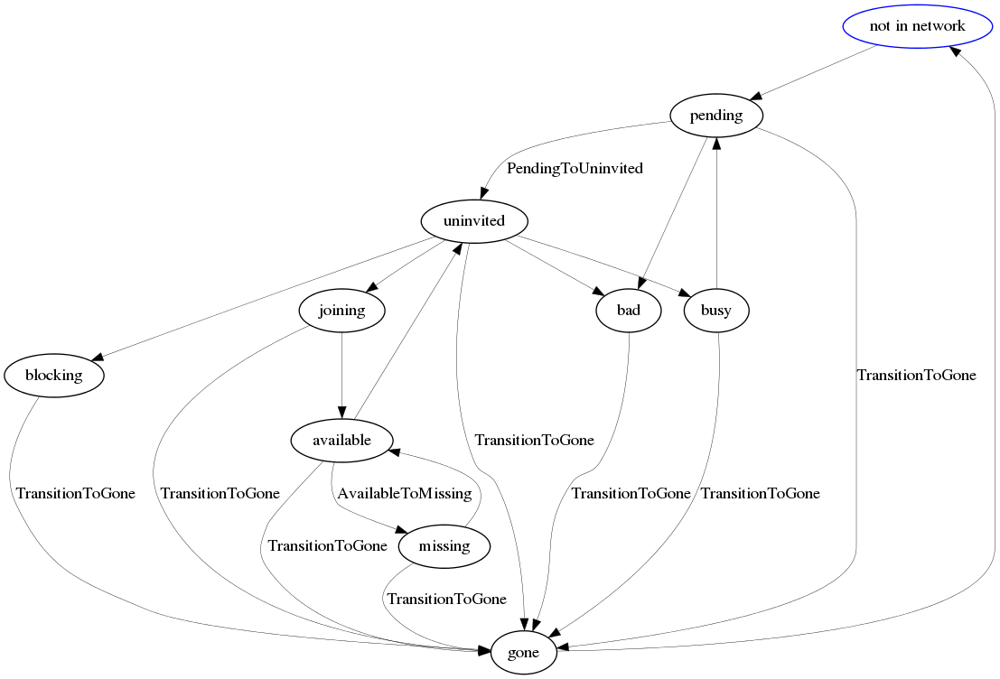

==============
Specifications
==============

The State Machine
-----------------

Each concert client participates in a state machine which tracks their lifecycle in the concert framework.
This state machine enables us to make quick decisions if needed or to remember the current state and
delay the decision until the next cycle of decision making comes around.

Important Files
---------------

* ``concert_msgs/ConcertClientState.msg`` : list of states in string format.
* ``concert_msgs/ConductorGraph.msg`` : call the __slots__ variable of this msg to get a list of all the states.
* ``ConcertClients._update()`` : this is where the decision making loop starts, relays out to the other update functions and triggers transitions if reqd.
* ``ConcertClient.update()`` : common updates for clients that have been observed on the gateway network.
* ``ConcertClients._update_xxx_client()`` : state specific updates for clients that have been observed on the gateway network.
* ``ConcertClient.transition()`` : called post-updates if a transition is required, this relays out to the specific transition callbacks.
* ``concert_conductor/transitions.py`` : the transition table and state specific transition callbacks.
 
